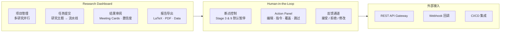
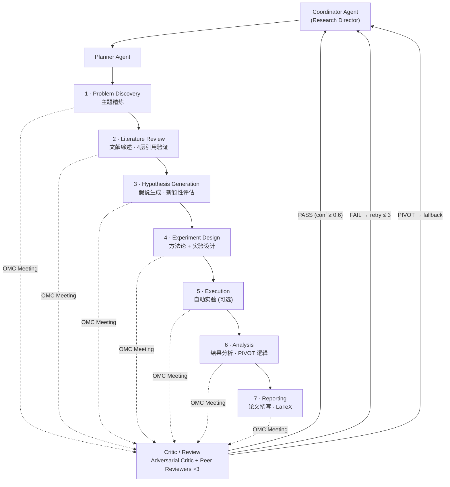
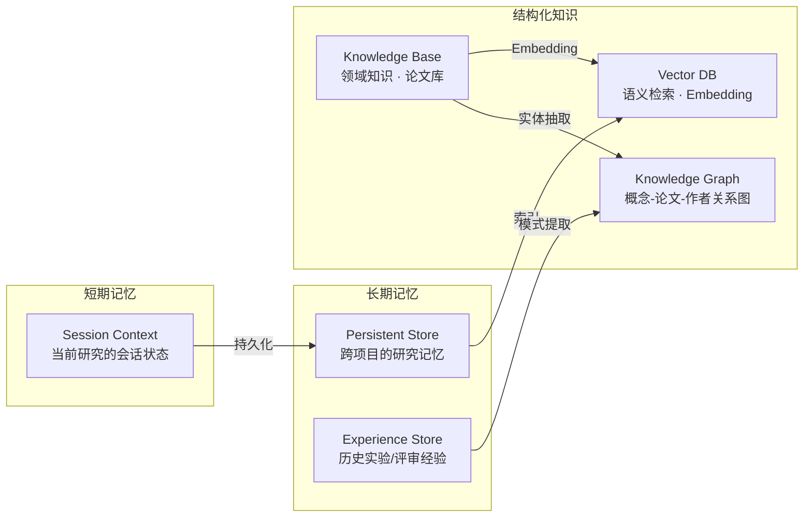
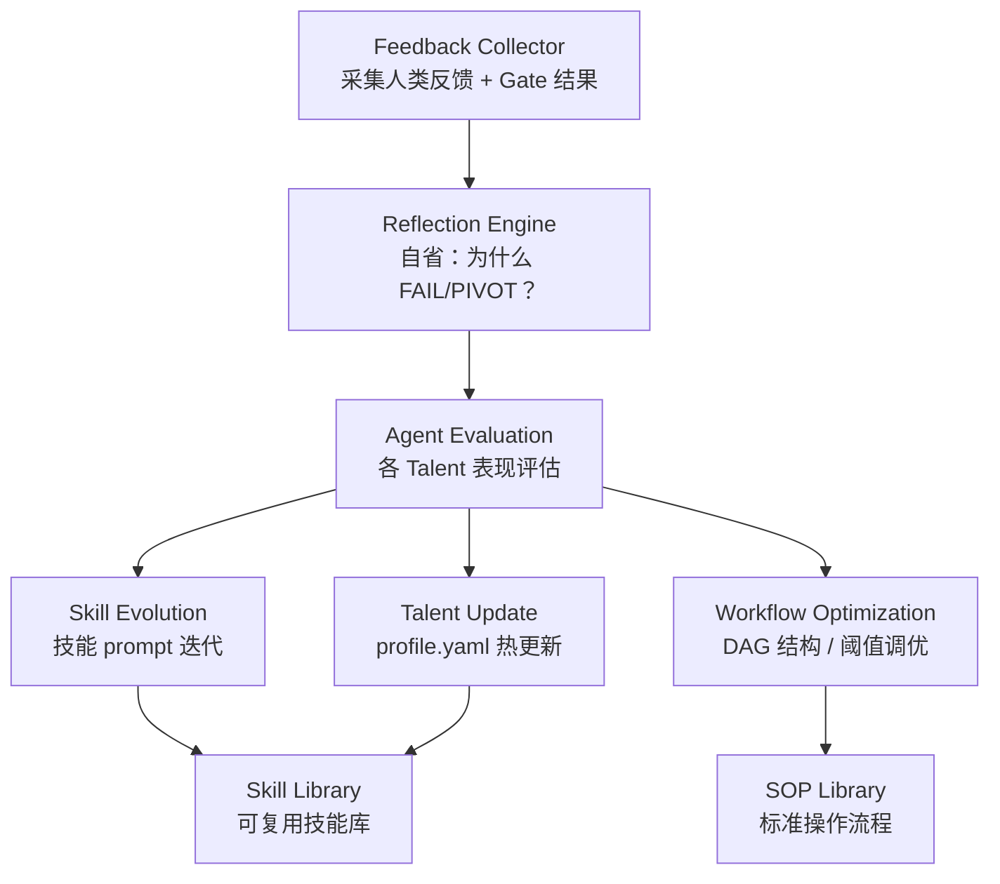
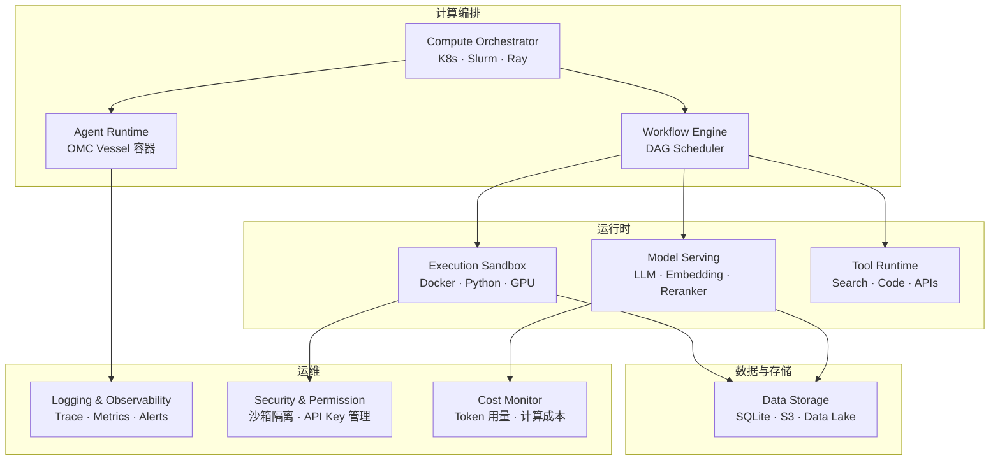
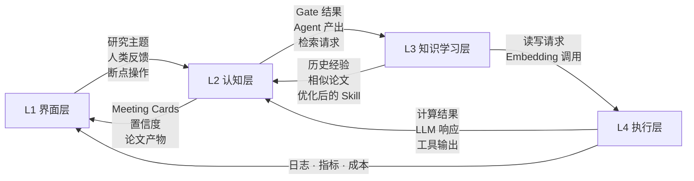
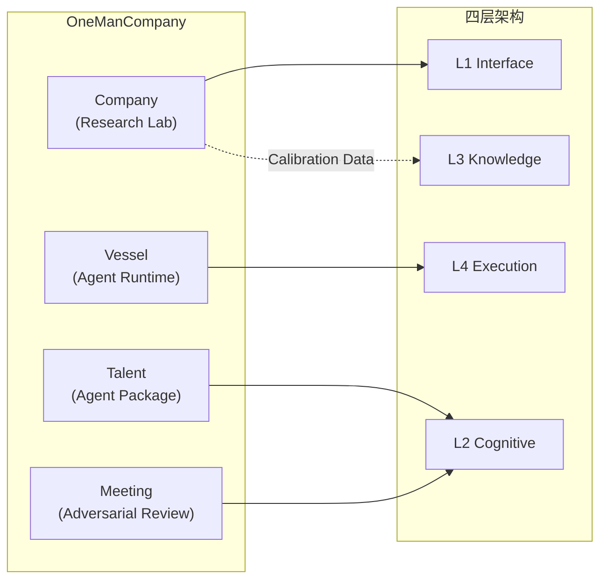

# System Architecture Diagram

AutoResearch 四层系统架构。基于 [[OneManCompany]] 骨架，将对抗式科研流水线分解为**界面层、认知层、知识学习层、执行层**四个关注面。

---

## 四层架构总览

```mermaid
flowchart TB
    subgraph L1["🖥️ L1 · Interface Layer 界面层"]
        A1["Research Dashboard<br/>研究仪表盘"]
        A2["Project Management<br/>项目管理"]
        A3["Task Submission<br/>任务提交"]
        A4["Result Review<br/>结果审阅"]
        A5["Report Export<br/>报告导出"]
        A6["Human Feedback<br/>人类反馈 / 断点介入"]
        A7["API Gateway<br/>外部接入"]
    end

    subgraph L2["🧠 L2 · Cognitive Layer 认知层"]
        B1["Coordinator Agent<br/>Research Director"]
        B2["Planner Agent<br/>任务规划"]

        subgraph Pipeline["🔬 Research Pipeline 研究流水线"]
            B3["Problem Discovery<br/>主题精炼"]
            B4["Literature Review<br/>文献综述"]
            B5["Hypothesis Generation<br/>假说生成"]
            B6["Experiment Design<br/>实验设计"]
            B7["Execution<br/>自动实验"]
            B8["Analysis<br/>结果分析"]
            B9["Reporting<br/>论文撰写"]
        end

        B10["Critic / Review<br/>对抗评审 + Peer Review"]
    end

    subgraph L3["📚 L3 · Knowledge & Learning Layer 知识学习层"]
        subgraph M["Memory System 记忆系统"]
            C1["Short-term Memory<br/>会话上下文"]
            C2["Long-term Memory<br/>跨项目持久化"]
            C3["Knowledge Base<br/>领域知识库"]
            C4["Vector DB<br/>语义检索"]
            C5["Knowledge Graph<br/>实体关系图谱"]
            C6["Experience Store<br/>历史经验库"]
        end

        subgraph E["Learning Engine 学习引擎"]
            C7["Feedback Collector<br/>反馈采集"]
            C8["Reflection Engine<br/>自省推理"]
            C9["Agent Evaluation<br/>Agent 评估"]
            C10["Skill Evolution<br/>技能演化"]
            C11["Workflow Optimization<br/>流程优化"]
            C12["Talent Update<br/>Talent 热更新"]
            C13["Skill Library<br/>技能库"]
            C14["SOP Library<br/>标准操作流程库"]
        end
    end

    subgraph L4["⚙️ L4 · Execution Layer 执行层"]
        D1["Compute Orchestrator<br/>K8s · Slurm · Ray"]
        D2["Agent Runtime<br/>OMC Vessel"]
        D3["Workflow Engine<br/>DAG Scheduler"]
        D4["Execution Sandbox<br/>Docker · Python"]
        D5["Data Storage<br/>DB · Data Lake"]
        D6["Model Serving<br/>LLM · Embedding"]
        D7["Tool Runtime<br/>Search · Code · APIs"]
        D8["Logging & Observability<br/>日志与可观测性"]
        D9["Security & Permission<br/>安全与权限"]
        D10["Cost Monitor<br/>成本监控"]
    end

    %% 层间连接
    A3 --> B1
    A6 --> B1
    A7 --> B1
    B1 --> B2
    B2 --> Pipeline
    Pipeline -.->|Meeting| B10
    B10 -->|PASS / FAIL / PIVOT| B1
    A4 --> B9
    A5 --> B9

    B1 --> C1
    B10 --> C7
    Pipeline --> C4
    B4 --> C3
    B4 --> C5

    C8 --> C10
    C9 --> C12
    C11 --> C14

    D2 --> B1
    D3 --> Pipeline
    D4 --> B7
    D6 --> Pipeline
    D7 --> B4
    D7 --> B7

    C6 --> D5
    C4 --> D5
    C2 --> D5
```

---

## L1 · Interface Layer 界面层

用户与系统的所有交互入口。基于 [[Ivy Collection]] 设计语言。

| 组件 | 职责 | 关联 |
|------|------|------|
| Research Dashboard | 研究进度总览、Meeting Card 流 | [[Overview]] |
| Project Management | 多研究项目并行管理 | — |
| Task Submission | 接收研究主题，配置断点和参数 | [[Research Pipeline Stages]] |
| Result Review | 审阅每阶段产出、置信度可视化 | [[Calibrated Confidence]] |
| Report Export | LaTeX / PDF / 数据集导出 | — |
| Human Feedback | 断点介入、覆盖 Critic 决策 | [[Adversarial Pipeline]] |
| API Gateway | 程序化接入、外部系统集成 | — |

---

## L2 · Cognitive Layer 认知层

系统的"大脑"。所有推理、规划、研究执行和对抗评审在此发生。

| 组件 | 对应 OMC Talent | 职责 |
|------|----------------|------|
| Coordinator Agent | research-director (COO) | 全局编排、PIVOT 决策、断点管理 |
| Planner Agent | — (Director 子模块) | 将研究目标分解为 DAG 任务图 |
| Problem Discovery | topic-refiner | 精炼用户输入为可研究问题 |
| Literature Review | literature-surveyor | 4 层引用验证，最高失败率阶段 |
| Hypothesis Generation | idea-generator | 新颖假说 + 对抗新颖性评估 |
| Experiment Design | methodology-designer + experiment-designer | 方法论设计 + 实验方案 |
| Execution | experimentalist | Docker/GPU 自动实验 (理论研究可跳过) |
| Analysis | result-analyst | 结果分析、统计验证、PIVOT 逻辑 |
| Reporting | paper-writer | LaTeX 论文生成 (NeurIPS/ICML/ICLR 模板) |
| Critic / Review | adversarial-critic + peer-reviewer ×3 | 对抗评审 + 最终质量门控 |

> [!tip] 设计要点
> Planner Agent 是新增角色，负责将高层研究目标拆解为可执行的 DAG 任务图，使 Coordinator 专注于编排和异常处理。

---

## L3 · Knowledge & Learning Layer 知识学习层

系统的"记忆"与"进化"能力。分为**记忆系统**和**学习引擎**两个子系统。

### Memory System 记忆系统

| 组件 | 职责 | 读取方 | 写入方 |
|------|------|--------|--------|
| Short-term Memory | 当前研究的 Agent 会话上下文 | 所有 Agent | Coordinator |
| Long-term Memory | 跨研究项目的持久化记忆 | Coordinator, Planner | 研究结束时归档 |
| Knowledge Base | 领域论文、方法论、数据集元信息 | Literature Surveyor, Idea Generator | 文献综述阶段 |
| Vector DB | 语义相似度检索 (论文、经验) | 所有 Pipeline Agent | 自动索引 |
| Knowledge Graph | 概念 → 论文 → 作者 → 方法关系网络 | Literature Surveyor, Hypothesis Generator | 文献综述 + 分析阶段 |
| Experience Store | 历史 Gate 决策、置信度轨迹、PIVOT 记录 | Coordinator, Critic | [[Calibrated Confidence]] |

### Learning Engine 学习引擎

| 组件 | 职责 | 触发条件 |
|------|------|---------|
| Feedback Collector | 汇聚人类反馈 + 自动 Gate 结果 | 每次 Meeting 结束 |
| Reflection Engine | 分析失败/PIVOT 原因，提取教训 | FAIL 或 PIVOT 发生时 |
| Agent Evaluation | 评估各 Talent 的 pass rate / 置信度校准 | 研究完成时批量评估 |
| Skill Evolution | 迭代 Talent 的 skill prompt | 评估发现 underperformance |
| Workflow Optimization | 调整 DAG 拓扑、Gate 阈值、重试策略 | 累积足够历史数据后 |
| Talent Update | 热更新 Talent 的 profile.yaml | Skill Evolution 产出 |
| Skill Library | 可复用的 skill markdown 文件池 | Skill Evolution 沉淀 |
| SOP Library | 标准操作流程 (如 4 层引用验证步骤) | Workflow Optimization 沉淀 |

> [!important] 核心闭环
> L2 Cognitive 产出结果 → L3 Feedback Collector 采集 → Reflection 分析 → Evaluation 评估 → Skill/Workflow 迭代 → L2 Agent 能力提升。这是系统的**自我进化闭环**。

---

## L4 · Execution Layer 执行层

所有计算、存储、模型调用和工具执行的基础设施。

| 组件 | 技术选型 | 职责 |
|------|---------|------|
| Compute Orchestrator | K8s / Slurm / Ray | 分配计算资源，管理 Agent 实例伸缩 |
| Agent Runtime | OMC Vessel | Agent 运行容器，生命周期管理 |
| Workflow Engine | DAG Scheduler | 编排多阶段 Pipeline 的执行顺序和依赖 |
| Execution Sandbox | Docker + Python | 隔离实验代码执行环境 (GPU 可选) |
| Data Storage | SQLite + S3 | 置信度日志、论文产物、数据集存储 |
| Model Serving | Claude / OpenRouter | LLM 推理 + Embedding + Reranker |
| Tool Runtime | Web Search / Code Exec / APIs | Agent 可调用的外部工具集 |
| Logging & Observability | — | 全链路 Trace、指标采集、异常告警 |
| Security & Permission | — | 沙箱隔离、API Key 轮转、权限控制 |
| Cost Monitor | — | Token 用量追踪、计算成本预算控制 |

---

## 层间数据流

四层之间的关键数据流向：

---

## 与 OMC 骨架的映射

> [!note] 当前状态
> 设计阶段完成，前端 V3 交互原型已上线。L3 知识学习层和 L4 执行层为新增架构设计，待后端实现。

> [!tip] 相关页面
> - [[Overview]] — 项目总览
> - [[Adversarial Pipeline]] — 对抗式流水线核心概念
> - [[OMC Talents]] — Talent 结构与角色定义
> - [[OMC Meetings]] — 多智能体对抗讨论机制
> - [[Calibrated Confidence]] — 置信度校准系统
> - [[Research Pipeline Stages]] — 研究阶段详解
